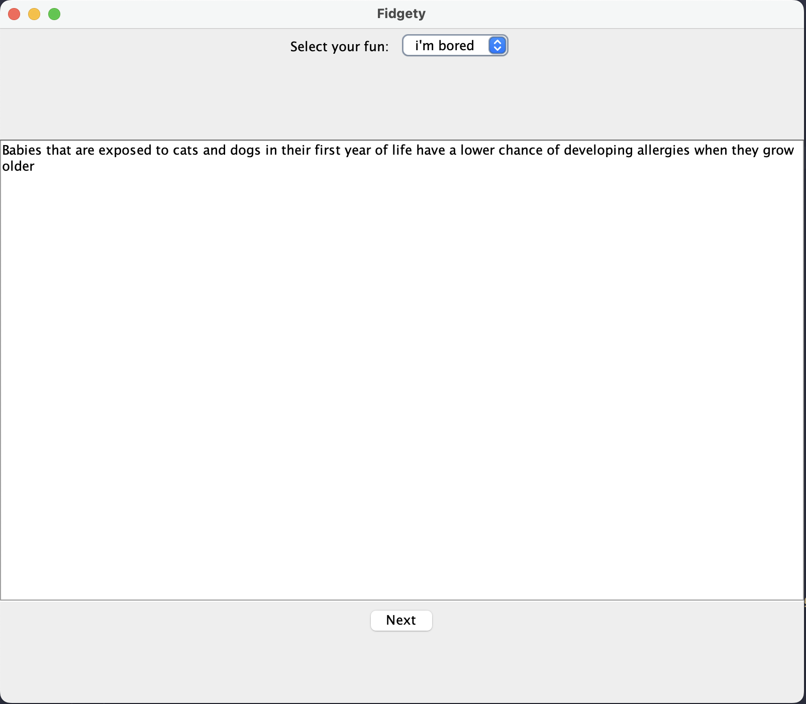
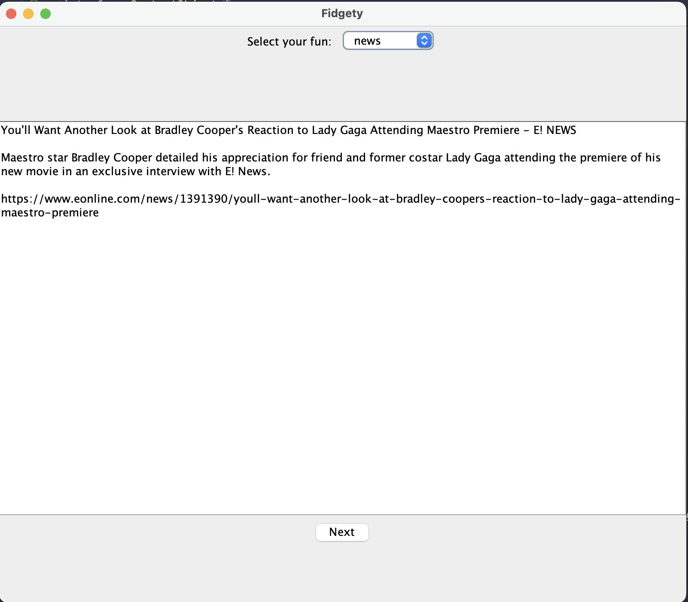
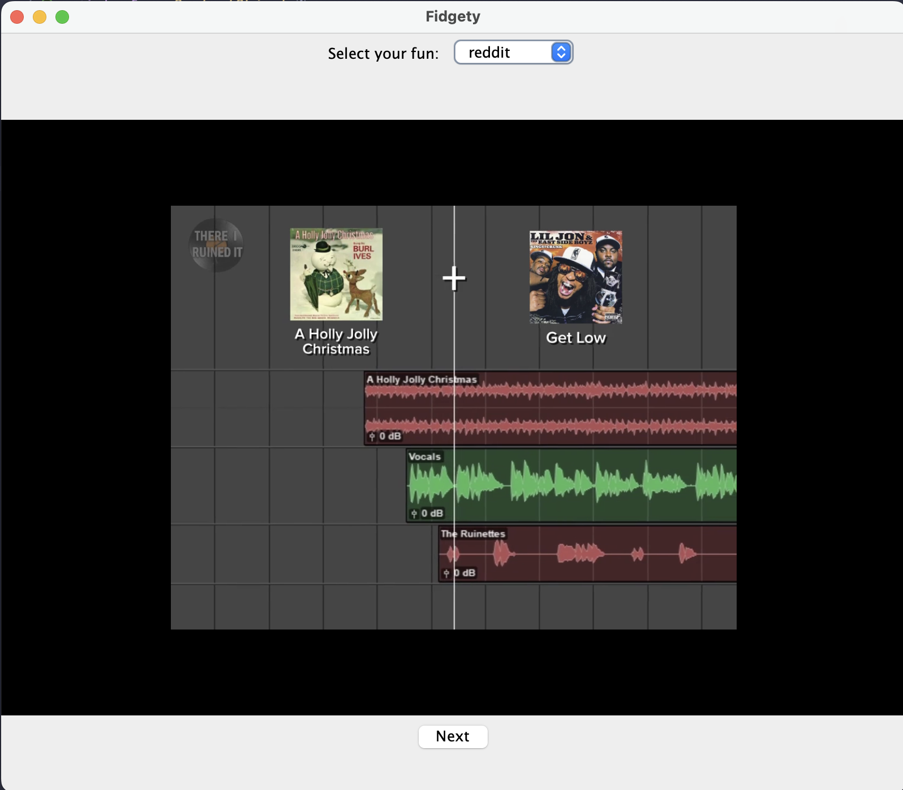
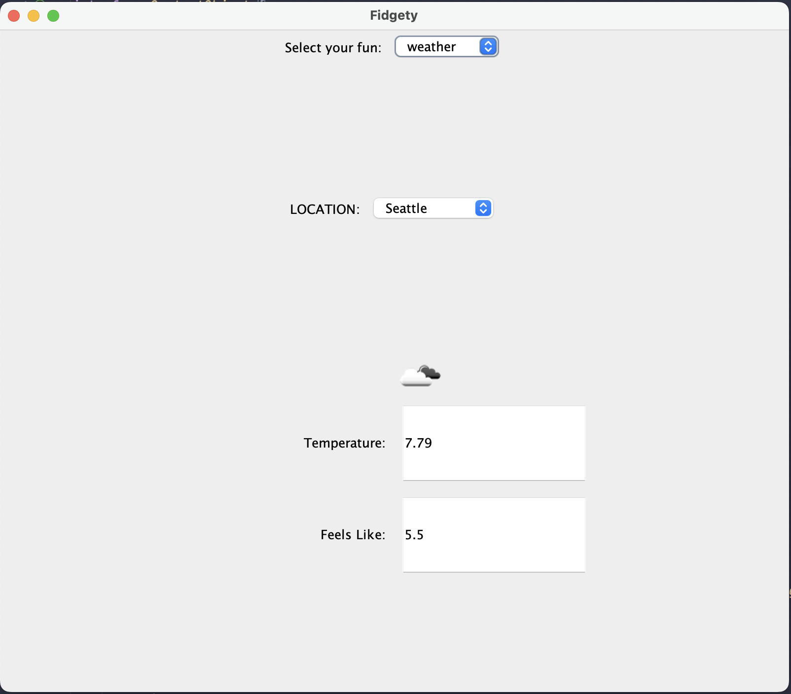

# FidgetApp
## Description
FidgetApp is a desktop application that allows users to view the latest reddit, facts, news and weather.
The goal of the app is to help with context switching during development, the idea 
is to only provide bitesize content that is limited so that users don't become distracted scrolling on 
social media and get carried away from their tasks. 

<p align="center">
  
   
  
  
</p>

## How to use
### 1. Git pull repository to local 
### 2. Set up environment variables
#### 2.1 create .env file in root directory 
#### 2.2 add the following variables to the .env file
```
NEWS_API_KEY={news api key: https://newsapi.org/}
W_API_KEY={weatheropenapi key: https://openweathermap.org/api}
BORED_API_KEY = {fact api key: https://api-ninjas.com/api/facts}
```
### 3. Ensure you have maven installed
```
brew install maven
```
### 4. Run the following command in the root directory
```
*ensure you have set it executable: chmod +x run-fidgetapp.sh* 

./run-fidgetapp.sh
```
### 5. Enjoy the app!
You should be able to trigger the app to launch using 
```
run-fidgetapp
```
# UML Diagrams
[](https://tinyurl.com/yukc5b2h)<!---->

## Project Details
### Design 
The project is designed using the MVC pattern, 
the model is the data that is being fetched from the APIs, the view is the UI and the controller is the logic 
that is used to fetch the data and update the view.

The model takes in ContentObject interface, this ensures that all future features added 
will have to implement the interface and provide the necessary methods to be able to be displayed on the UI.

### Project Setup 
#### 1. CI/CD
Another highlight of this project was playing around with github's CI pipeline. This is done by using github workflows and 
using maven. The script is located in .github/workflows/maven.yml. The script is triggered on every push to the master branch
and ensures that the newly pushed version of the code is able to build and pass local tests. 
#### 2. Bash script 
While exploring how to better package the app into something that is more easily run, I played with bash script to streamline
the process of running the app. The script is located in the root directory and is called run-fidgetapp.sh. The script utilizes
maven to compile the app and then assign an alias to a line of maven script that would trigger the app to start. 